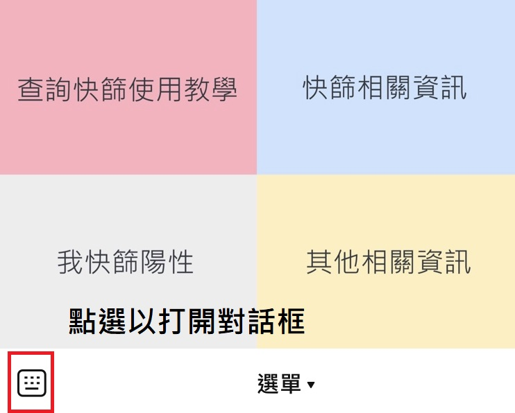
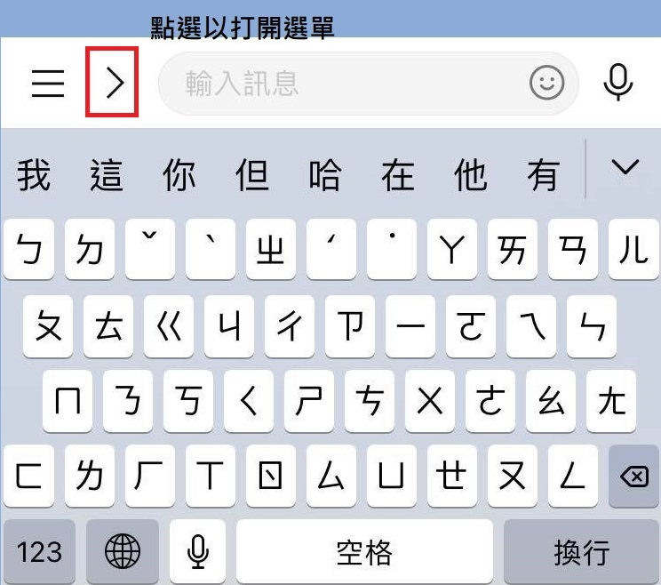
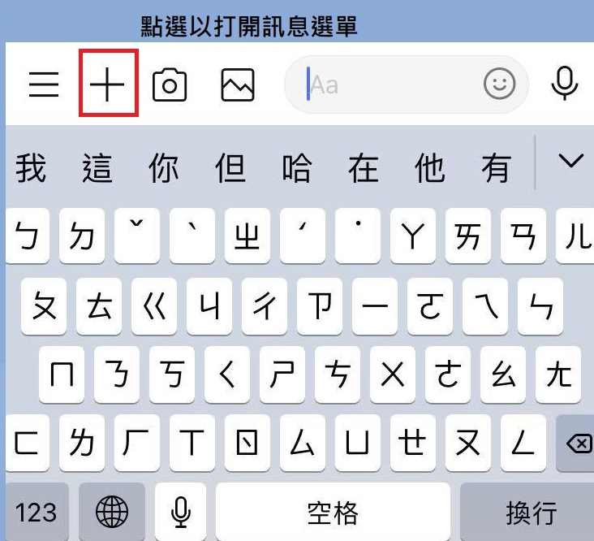
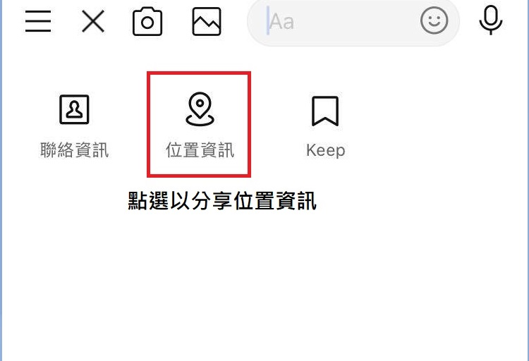
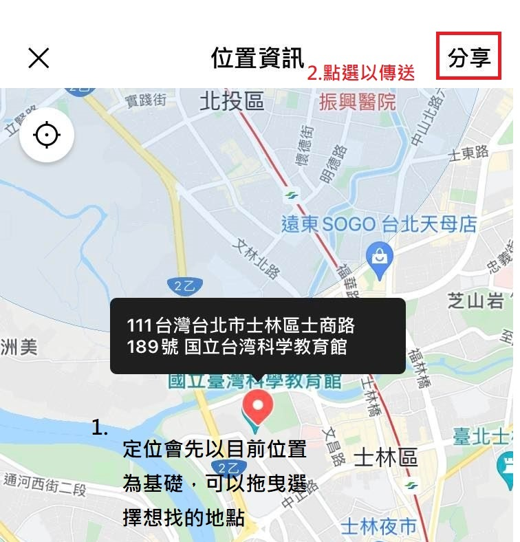
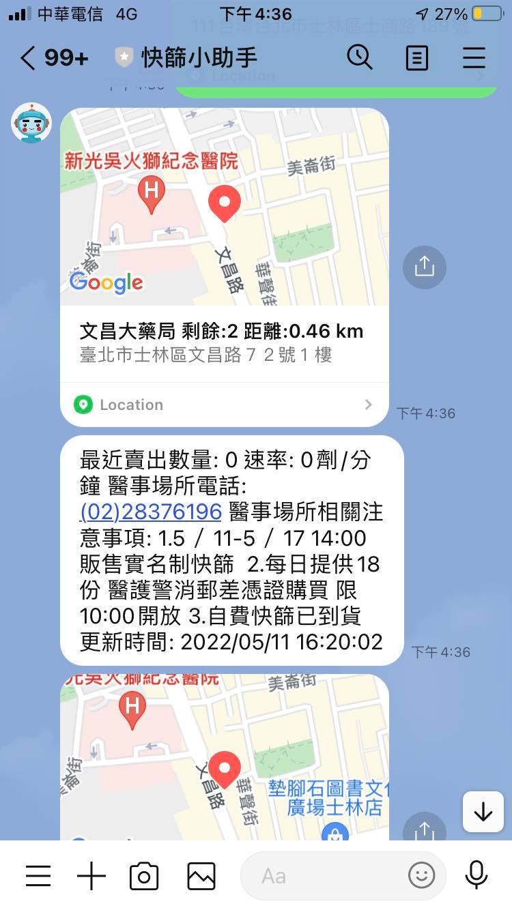

# Covid-19 ChatBot

---

## Description

協助快速查詢推薦快篩販售地點相關資訊，以及快篩陽性相關處理Q&A

## Environment

* python3.6.5

* AWS Lambda

* AWS Gateway

* LineBot API

* DynamoDB

## Deploy

1. Create AWS Lambda
2. Create AWS DynamoDB and Table.
3. Create AWS Layer with requirements.txt (linebotsdk package).
4. Configure AWS Gateway with REST API and POST method.
5. Get AWS GateWay URL.
6. Create Line Bot and configure the listening url(GateWay URL).

## Demo

## To DO

- [ ] 持續新增疫情不同應對情境
- [ ] 增加口語式對答，讓問答更加彈性
- [ ] 快篩試劑將販賣速率及到達時間兩者納入Top K選擇
- [ ] 調整模板讓使用者體驗更好 
